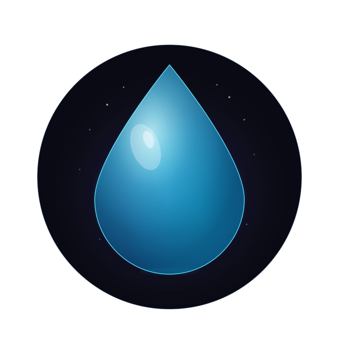

<div align="center">
  
  <h1>Aqua Launcher</h1>
  <p><strong>Lightweight & Polished Minecraft Launcher built with Electron.</strong></p>
  
  <br>
  
  
  
  
  
</div>

---

### 📋 Overview
**Aqua Launcher** is a lightweight, desktop-first Minecraft launcher. It provides a polished interface for managing modpacks, version control, and custom loader configurations, ensuring a seamless experience for power users.

### 🚀 Key Features
* **Custom Modpack Management:** Isolated asset folders for per-pack organization.
* **Modrinth Integration:** Fast version resolution for compatible downloads.
* **Persistent Configs:** Intelligent RAM and JVM settings handling.
* **Modern UI/UX:** Desktop-style chrome with native drag support.
* **System Notifications:** Real-time feedback on launch status.

---

### 📂 Project Structure
```text
├── main.js         # Main process & IPC handlers
├── renderer.js     # UI logic & event handling
├── preload.js      # Secure bridge
├── launcher.html   # Main layout template
├── services/       # Modpack & launcher logic
├── assets/         # Icons & branding
└── build.bat       # Windows packaging script
