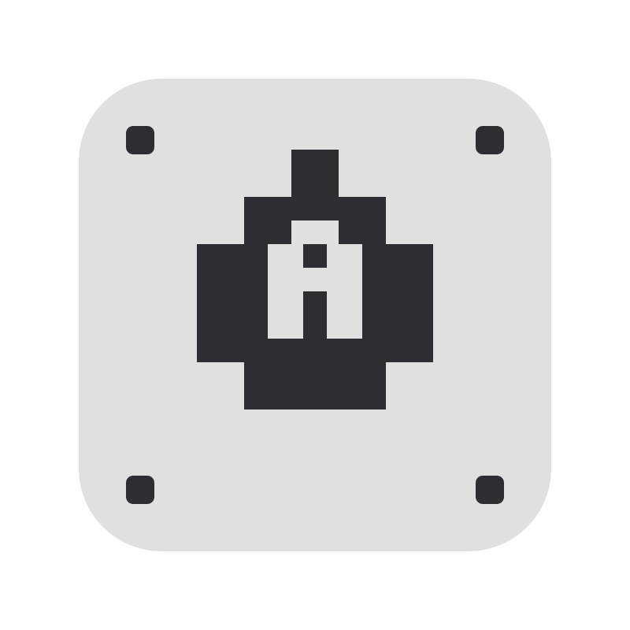

<!-- Improved compatibility of back to top link: See: https://github.com/othneildrew/Best-README-Template/pull/73 -->
<a id="readme-top"></a>

[![Contributors][contributors-shield]][contributors-url]
[![Forks][forks-shield]][forks-url]
[![Stargazers][stars-shield]][stars-url]
[![Issues][issues-shield]][issues-url]
[![MIT License][license-shield]][license-url]

<br />
<div align="center">
  

  <h3 align="center">Aqua Launcher</h3>

  <p align="center">
    A premium, high-performance Minecraft launcher powered by Electron.
    <br />
    <a href="#about-the-project"><strong>Explore the architecture »</strong></a>
    <br />
    <br />
    <a href="#getting-started">Getting Started</a>
    &middot;
    <a href="#usage">Usage Guidelines</a>
    &middot;
    <a href="#page-architecture">Page Previews</a>
  </p>
</div>

<details>
  <summary>Table of Contents</summary>
  <ol>
    <li>
      <a href="#about-the-project">About The Project</a>
      <ul>
        <li><a href="#built-with">Built With</a></li>
        <li><a href="#core-mechanics">Core Mechanics</a></li>
      </ul>
    </li>
    <li>
      <a href="#page-architecture">Page Architecture</a>
      <ul>
        <li><a href="#home-menu">Home Menu</a></li>
        <li><a href="#modpacks-menu">Modpacks Menu</a></li>
        <li><a href="#multiplayer-menu">Multiplayer Menu</a></li>
        <li><a href="#settings-menu">Settings Menu</a></li>
      </ul>
    </li>
    <li>
      <a href="#getting-started">Getting Started</a>
      <ul>
        <li><a href="#prerequisites">Prerequisites</a></li>
        <li><a href="#installation">Installation</a></li>
      </ul>
    </li>
    <li><a href="#roadmap">Roadmap</a></li>
    <li><a href="#contributing">Contributing</a></li>
    <li><a href="#license">License</a></li>
    <li><a href="#contact">Contact</a></li>
  </ol>
</details>

## About The Project

[![Aqua Launcher Overview Screenshot][product-screenshot]](https://github.com/yamanist0/minecraft-aqua-launcher)

Aqua Launcher is an independent, highly optimized Minecraft launcher built using Electron and modern web technologies. It is engineered to supersede traditional game launchers by providing deep integration with global modpack repositories, independent local storage isolation, and an incredibly fluid user interface.

Unlike standard launchers that clutter the root game directory, Aqua Launcher utilizes isolated environment deployments for individual modpacks. This guarantees that Minecraft configuration files, save states, modifications, and dependencies operate cleanly per-instance. Furthermore, the application relies heavily on dynamic DOM manipulation and caching to simulate native performance standards, leveraging specialized proxies to bypass API restrictions on CurseForge and Modrinth.

### Built With

* [![Electron][Electron-badge]][Electron-url]
* [![TailwindCSS][Tailwind-badge]][Tailwind-url]
* [![Node.js][Node-badge]][Node-url]

### Core Mechanics

The core philosophy of Aqua Launcher revolves around a modular, asynchronous interaction logic between the background Node process and the visual Chromium sandbox.

* **Inter-Process Communication:** Preload scripts negotiate secure streams between the frontend and core framework, exposing only critical filesystem and network directives to the renderer layout.
* **Authentication:** Integrates specialized modules for certified Microsoft Xbox Live handshakes, securely retrieving access tokens and managing encrypted offline mode environments.
* **Dynamic Resolution:** Modrinth and CurseForge interactions are facilitated through custom Cloudflare Worker proxies to sanitize REST inputs and bypass strict CORS protocols, allowing the client to resolve manifest formats dynamically before pushing data to the localized download core.
* **Liquid Animations:** Relies exclusively on Tailwind utility toggles interacting directly with CSS rulesets to orchestrate non-blocking scale, opacity, transform, and dual-tone shadow transitions across internal navigation views without causing rigid reflow bottlenecks.

### Design Language

Aqua Launcher follows a strict **neomorphism (Soft UI)** language, evolved from an earlier glassmorphism treatment. Translucent blur panels were retired in favor of opaque, layered surfaces that read crisply against the panoramic backdrop.

* **Soft Surfaces:** Every card, chip, toggle, and dock is raised from the `#2d2d32` base canvas using paired shadows: a dark `#1f1f23` cast on the bottom-right and a light `#3b3b41` highlight on the top-left. Interactive wells invert this energy into inset shadows, simulating physically pressed material.
* **Aqua Accent:** A single `#87CEFA` accent tone drives focus rings, badges, progress fills, and status indicators across the interface, with a deeper `#5A9FD1` derivative shading gradient artwork.
* **Blocky Brand Mark:** The launcher monogram is a pixelated water drop carrying a raised `A`, executed in flat geometry and identical dual-tone physics so the identity stays consistent from the sidebar to the Windows taskbar.
* **Uniform Radii:** A consistent 22px corner radius and consistent 8px shadow extrusion geometry keep depth, elevation, and spacing predictable on every view.

<p align="right">(<a href="#readme-top">back to top</a>)</p>

## Page Architecture

Aqua Launcher isolates content rendering into structured HTML partition blocks within a singular environment, selectively rendering frames to optimize hardware memory loading overheads. Below is a careful inspection of the application pages.

### Home Menu

[![Home Menu Screenshot][home-screenshot]](https://github.com/yamanist0/minecraft-aqua-launcher)

The Home Menu serves as the central command hub of the client. Upon authentication, asynchronous loops query local persistence profiles alongside isolated remote APIs to construct discovery panels.

* **Modpack Explorer Carousel:** Instantly presents high-priority content items directly over a horizontal flex framework. Cards deploy an active visual skeleton masking sequence to counteract layout shifting before raw network data finalizes.
* **Live Server Highlights:** Integrates dynamic server retrieval, parsing JSON inputs to pull multiplayer connections directly onto the main page, generating immediate fast-join references.
* **News Aggregator:** Fetches localized or remote repository data detailing gameplay shifts, system updates, and community alerts, populating symmetrically across timeline blocks.
* **Persistent State Navigation:** Logs the exact parameters of the previously launched version instance and memory allocation to the master storage variables automatically, establishing the bottom operational dock for absolute minimal-click deployments.

### Modpacks Menu

[![Modpacks Menu Screenshot][modpacks-screenshot]](https://github.com/yamanist0/minecraft-aqua-launcher)

This module handles absolute fetching, localized formatting, and indexing mapping of customized engine states.

* **Four-Tier Architecture:** Smooth tab logic swaps the application query scope linearly across Installed Archives, Custom Catalogs, Modrinth Repositories, and the external CurseForge ecosystem.
* **Intelligent File Scaffolding:** Engages custom unpacking algorithms utilizing `adm-zip` to extract `.mrpack` architecture arrays and standard zip layouts interchangeably on the node system.
* **Search and Filter Dynamics:** An input detection protocol bound to native debouncing intercepts query exhaustion. This executes secure backend requests returning faceted categories immediately while preserving rigid application fluidity. 
* **State Masking:** Unidentified, remote library nodes deploy inset neumorphic wells. These states transfer gracefully into deterministic progress boundaries informing file manipulation phases up until installation termination transforms into standard execution nodes.

### Multiplayer Menu

[![Multiplayer Menu Screenshot][multiplayer-screenshot]](https://github.com/yamanist0/minecraft-aqua-launcher)

An optimized discovery grid parsing specialized IP registries to map external hub references automatically, depending on backend configuration maps.

* **Chronological Ping Mechanics:** Asynchronously pings remote Java Edition domains spanning across interval limits, writing active server densities and player parameters directly onto interactive cards.
* **Clipboard Intercept:** Tracks click operations dynamically over individual network objects to store host addresses directly into the local system clipboard memory immediately, firing localized toast verifications.
* **Logical Page Navigation:** Processes mathematical slicing offsets to subdivide extensive network arrays chronologically across manageable categories, drastically limiting DOM bloat.

### Settings Menu

[![Settings Menu Screenshot][settings-screenshot]](https://github.com/yamanist0/minecraft-aqua-launcher)

A secured sector operating strict parameters governing the backend node daemon processing logic.

* **Secure Authentication Control:** Bounded by an animated screen gate demanding secondary credentials prior to entry (when set up).
* **Proxy Binding Configuration:** Submits explicit overrides specifying CurseForge domain fetch proxies, preserving routing capabilities over alternative infrastructure variants.
* **Java Virtual Machine Arbiters:** Submits unrestricted string parameters linking directly against sub-process initiation modules. These commands coordinate deep systems ranging from external hardware acceleration rules to native garbage compilation flags.
* **Volatile Memory Controls:** Interactive arbitrary range bindings strictly connected to the master system file (`settings.json`). Adjusts explicit boundary allocations before process executions.

<p align="right">(<a href="#readme-top">back to top</a>)</p>

## Getting Started

To operate or compile the Aqua Launcher base locally, initialize the Node development ecosystem parameters over your terminal.

### Prerequisites

You must execute commands utilizing native NPM standards.
* npm
  ```sh
  npm install npm@latest -g
  ```

### Installation

1. Establish your Cloudflare Worker node endpoints corresponding to CurseForge parameters (native instances use generic placeholders inside settings).
2. Clone the core repository locally.
   ```sh
   git clone https://github.com/yamanist0/minecraft-aqua-launcher.git
   ```
3. Read the master requirements and pull modules utilizing standard npm patterns.
   ```sh
   npm install
   ```
4. Sub-launch the development build wrapper.
   ```sh
   npm start
   ```

<p align="right">(<a href="#readme-top">back to top</a>)</p>

## Usage

Aqua Launcher relies completely onto `launcher-service.js` logic handlers which maintain overarching application isolation schemas. 

1. **Authentication Sequences:** Establish offline parameter bypass modes or validate standard tokens via Microsoft endpoints directly internally without shifting browser logic strings.
2. **Dynamic Dependency Selection:** Trigger modals designed to parse Vanilla parameters alongside respective Forge and Fabric arrays via specific meta networks independently to circumvents standard Chromium visibility conflicts against absolute CSS layouts.
3. **Execution Sequences:** Triggers command streams through localized metadata evaluation checks mapped specifically over `.minecraft/versions` architecture loops. Executes internal configurations routing through isolated directory mappings without breaking core local save operations.

<p align="right">(<a href="#readme-top">back to top</a>)</p>

## Roadmap

- [x] Configure Microsoft backend authorizations directly resolving against Xbox Live flows.
- [x] Assemble internal modpack abstraction logic merging independent network endpoints uniformly.
- [x] Format internal rendering state triggers enforcing rigid skeletal masking loops against local files.
- [x] Integrate precise transition controls replacing rigid framework classes exclusively toward dynamic scale behaviors.
- [ ] Enlist infinite scroll parsing logic against the chronological notification list mapping sequences.
- [ ] Implement integrated Java installation fallback handling protocols specifically managing JVM discrepancies.

<p align="right">(<a href="#readme-top">back to top</a>)</p>

## Contributing

1. Fork the Environment Sequence
2. Establish your Feature Tracking Context (`git checkout -b feature/Optimization`)
3. Committing Local Branches (`git commit -m 'Implement optimized routing arrays'`)
4. Direct Stream Overrides (`git push origin feature/Optimization`)
5. Finalize Pull Configurations

<p align="right">(<a href="#readme-top">back to top</a>)</p>

## License

Distributed under the MIT License. See `LICENSE` for more information.

<p align="right">(<a href="#readme-top">back to top</a>)</p>

## Contact

Project Link: [https://github.com/yamanist0/minecraft-aqua-launcher](https://github.com/yamanist0/minecraft-aqua-launcher)

<p align="right">(<a href="#readme-top">back to top</a>)</p>

[contributors-shield]: https://img.shields.io/github/contributors/yamanist0/minecraft-aqua-launcher.svg?style=for-the-badge
[contributors-url]: https://github.com/yamanist0/minecraft-aqua-launcher/graphs/contributors
[forks-shield]: https://img.shields.io/github/forks/yamanist0/minecraft-aqua-launcher.svg?style=for-the-badge
[forks-url]: https://github.com/yamanist0/minecraft-aqua-launcher/network/members
[stars-shield]: https://img.shields.io/github/stars/yamanist0/minecraft-aqua-launcher.svg?style=for-the-badge
[stars-url]: https://github.com/yamanist0/minecraft-aqua-launcher/stargazers
[issues-shield]: https://img.shields.io/github/issues/yamanist0/minecraft-aqua-launcher.svg?style=for-the-badge
[issues-url]: https://github.com/yamanist0/minecraft-aqua-launcher/issues
[license-shield]: https://img.shields.io/github/license/yamanist0/minecraft-aqua-launcher.svg?style=for-the-badge
[license-url]: https://github.com/yamanist0/minecraft-aqua-launcher/blob/main/LICENSE
[product-screenshot]: images/screenshot.png
[home-screenshot]: images/home-screenshot.png
[modpacks-screenshot]: images/modpacks-screenshot.png
[multiplayer-screenshot]: images/multiplayer-screenshot.png
[settings-screenshot]: images/settings-screenshot.png
[Electron-badge]: https://img.shields.io/badge/Electron-191970?style=for-the-badge&logo=Electron&logoColor=white
[Electron-url]: https://www.electronjs.org/
[Tailwind-badge]: https://img.shields.io/badge/Tailwind_CSS-38B2AC?style=for-the-badge&logo=tailwind-css&logoColor=white
[Tailwind-url]: https://tailwindcss.com/
[Node-badge]: https://img.shields.io/badge/Node.js-43853D?style=for-the-badge&logo=node.js&logoColor=white
[Node-url]: https://nodejs.org/ 